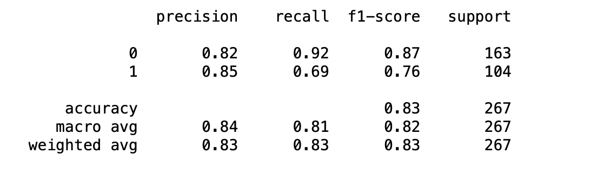

# <h1 align="center"><samp> Titanic Survival Prediction Project </samp></h1>

### Description:
In this project I will analyse the popular [titanic dataset from kaggle](https://www.kaggle.com/c/titanic) and predict a classification - (survival or deceased)

### Data:
Just for reference, there are two datasets attached in this project, one for training and one for testing. But I have just used the [training dataset](titanic_train.csv) and divided it further into two different sets, for training and testing. The numerical columns in the dataset which I have used are explained as:
* PassengerID: unique id for each passenger
* Survived: boolean value (0-deceased, 1-survived)
* Pclass: passenger class in the titanic
* SibSp: number of siblings or spouses on board
* Parch: number of parents or children on board
* Fare: amount paid of be on board

### Tools:
* Python
* Numpy
* Pandas
* Matplotlib
* Seaborn
* SciKitLearn
